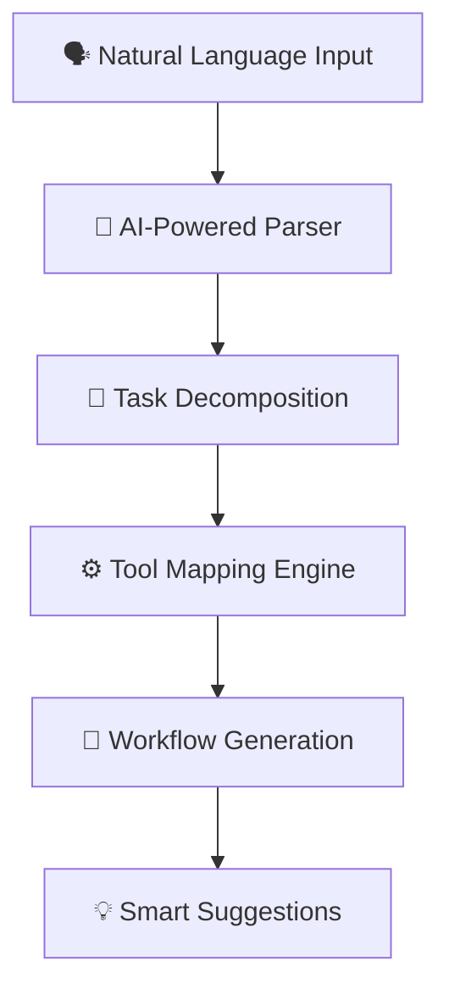

<div align="center">

# 🤖 Sempropos

[](https://www.python.org/downloads/)
[](https://opensource.org/licenses/MIT)
[](http://makeapullrequest.com)
[](https://github.com)

```ascii
 ╔═════════════════════════════════════════════════════════════════════════════════╗
 ║                                                                                 ║
 ║   ███████╗███████╗███╗   ███╗██████╗ ██████╗  ██████╗ ██████╗  ██████╗ ███████╗ ║
 ║   ██╔════╝██╔════╝████╗ ████║██╔══██╗██╔══██╗██╔═══██╗██╔══██╗██╔═══██╗██╔════╝ ║
 ║   ███████╗█████╗  ██╔████╔██║██████╔╝██████╔╝██║   ██║██████╔╝██║   ██║███████╗ ║
 ║   ╚════██║██╔══╝  ██║╚██╔╝██║██╔═══╝ ██╔══██╗██║   ██║██╔═══╝ ██║   ██║╚════██║ ║
 ║   ███████║███████╗██║ ╚═╝ ██║██║     ██║  ██║╚██████╔╝██║     ╚██████╔╝███████║ ║
 ║   ╚══════╝╚══════╝╚═╝     ╚═╝╚═╝     ╚═╝  ╚═╝ ╚═════╝ ╚═╝      ╚═════╝ ╚══════╝ ║
 ║                                                                                 ║
 ╚═════════════════════════════════════════════════════════════════════════════════╝
```

### 🧠 *Semantic Command-Line Intelligence*
**AI-Powered Workflow Generation | Beyond Traditional CLI Tools**

</div>

---

## ⚡ Problem Statement

Traditional UNIX tools like `man`, `apropos`, and `whatis` are powerful—but limited. They expect you to know *exactly* what you're looking for. But what if you could simply *describe* your objective?

> *"I want to monitor system performance and identify bottlenecks across CPU, memory, and disk usage."*

Instead of hunting through man pages or guessing tool names, **Sempropos** gives you instant, actionable workflows:

```bash
[1] Monitor CPU usage in real-time:
     top -b -n1 | head -20
[2] Check memory utilization:
     free -h && cat /proc/meminfo | grep Available
[3] Analyze disk I/O performance:
     iostat -x 1 5
[4] Identify resource-heavy processes:
     ps aux --sort=-%cpu | head -10
[5] Generate performance summary:
     vmstat 1 5 > performance_report.txt
```

Sempropos isn't just a search tool—it's an **AI-powered workflow generator**.

> 💭 *"I need to analyze network traffic for potential data exfiltration and generate a security report."*

**Sempropos approach:** Instant, multi-step workflow:

```bash
╭─ WORKFLOW GENERATED ────────────────────────────────────╮
│                                                         │
│  [1] 🌐 Capture network traffic:                        │
│      tcpdump -i eth0 -w traffic.pcap                    │
│  [2] 🔍 Analyze packet patterns:                        │
│      tshark -r traffic.pcap -T fields -e ip.src         │
│  [3] 🚦 Detect anomalous connections:                   │ 
│      netstat -tuln | awk '{print $4}' | sort | uniq     │
│  [4] 📈 Generate traffic statistics:                    │
│      capinfos traffic.pcap > network_summary.txt        │
│  [5] 📝 Create security report:                         │
│      echo "Security Analysis $(date)" > report.md       │
╰─────────────────────────────────────────────────────────╯
```

---

## 🎯 The Vision

**Sempropos** is a next-gen CLI intelligence system that transcends legacy UNIX utilities by transforming natural language intent into executable, multi-step workflows—like having a senior hacker’s wisdom at your fingertips.

> *"Stop searching for tools. Start describing problems."*

---

## 🚀 Motivation

Ever tried to solve a problem like:

> “I have an Android storage dump and want to find a deleted note.”

Instead of endless man page diving, Sempropos delivers:

```bash
[1] Extract the dump:
     unzip dump.zip -d extracted/
[2] List the directory tree:
     tree extracted/
[3] Search for note-related files:
     find extracted/ -iname '*note*'
[4] Inspect deleted or embedded files:
     binwalk -e suspicious_file
[5] Grep for useful text:
     grep -i 'note' -r extracted/
```

You describe the problem. Sempropos composes the workflow.

---

## 🧠 Core Capabilities



### What Makes It Different

- **Intent Understanding:** Semantic analysis beyond keyword matching
- **Problem Decomposition:** Breaks complex tasks into actionable steps
- **Tool Orchestration:** Maps sub-tasks to optimal CLI utilities
- **Workflow Synthesis:** Generates coherent command sequences
- **Future-Ready:** Extensible execution & refinement modules

---

## 🏗️ Architecture Blueprint

```
sempropos/
├── 🧠 core/                    # Neural engine components
│   ├── parser.py              # NL → Intent transformation
│   ├── planner.py             # Workflow synthesis engine
│   ├── tools_db.yaml          # Knowledge graph: tools ↔ tasks
│   └── executor.py            # Shell interface layer
├── ⚡ cli.py                   # Command-line entrypoint
├── 🎯 prompt_templates/        # LLM prompt engineering
├── 💡 examples/               # Curated query demonstrations
└── 📖 README.md               # This file
```

**Tech Stack**

```yaml
Core Language:     Python 3.10+ 🐍
Knowledge Base:    YAML Structure 📊
AI Integration:    LLM APIs | Local Models 🤖
Future Vision:     Offline-First | Plugin System 🔌
```

---

## ⚡ Quick Deploy

### System Requirements

```bash
Python     >= 3.10   🐍
Memory     >= 4GB    💾
Disk       >= 1GB    💿
Network    Optional  🌐  # For LLM APIs
```

### 🚀 Zero-to-Hero Setup

```bash
# 1️⃣ Clone the repository
git clone https://github.com/ADPer0705  /sempropos.git && cd sempropos

# 2️⃣ Environment activation
python -m venv .venv && source .venv/bin/activate

# 3️⃣ Dependency injection
pip install -r requirements.txt

# 4️⃣ Launch sequence initiated
python cli.py
```

### 🐳 Containerized Deployment

```bash
docker build -t sempropos .
docker run -it sempropos
```

### 🔧 Developer Mode

```bash
poetry install && poetry shell

# OR classic venv
python -m venv venv
source venv/bin/activate  # Windows: venv\Scripts\activate
pip install -r requirements.txt -r requirements-dev.txt
```

---

## 🎮 Interface Demo

```bash
$ python cli.py
╭─ SEMPROPOS v1.0 ─ AI-Powered Workflow Generator ────────╮
│                                                         │
│  🤖 Ready to transform your intent into action...       │
│                                                         │
╰─────────────────────────────────────────────────────────╯

> I want to extract text from scanned PDFs and remove headers
```

**AI Response:**

```bash
╭─ WORKFLOW SYNTHESIZED ──────────────────────────────────╮
│                                                         │
│  [1] 📄 OCR Processing with Tesseract:                  │
│      pdftotext scan.pdf output.txt                      │
│  [2] 🧹 Header Elimination:                             │
│      sed '/^Header/d' output.txt > cleaned.txt          │
│  [3] 🎯 Advanced Cleanup (Optional):                    │
│      awk '!/^(Page|Chapter|\f)/' cleaned.txt            │
╰─────────────────────────────────────────────────────────╯

💡 Tip: Use `pdfplumber` for more complex PDF structures
🔧 Alternative: `pdf2txt.py` from pdfminer for better accuracy
```

---

## 🧱 Technology Matrix

<div align="center">

| Component         | Technology              | Purpose                       |
|-------------------|-------------------------|-------------------------------|
| 🧠 Core Engine    | Python 3.10+            | Performance & type safety     |
| 📊 Knowledge Base | YAML                    | Structured tool mappings      |
| 🤖 AI Integration | OpenAI API / Local LLMs | Semantic understanding        |
| ⚡ Runtime        | AsyncIO                 | Non-blocking operations       |
| 🔌 Extensibility  | Plugin Architecture     | Community contributions       |

</div>

**Next-Gen Integrations**

```yaml
Planned_Integrations:
  knowledge_sources: [tldr, man, cheat.sh, explainshell]
  execution_layer: [shell_safety, user_confirmations]
  intelligence: [local_embeddings, retrieval_systems]
  architecture: [offline_first, zero_latency]
```

---

### Milestone Targets

- **Dialog Refinement:** Interactive query improvement with context awareness
- **Local Intelligence:** Offline embedding + retrieval for zero-latency responses
- **JARVIS Mode:** Automated workflow execution with intelligent safeguards
- **Plugin Ecosystem:** Community-driven tool integrations and extensions
- **Learning Engine:** Persistent history with user preference adaptation
- **Offline-First:** Complete functionality without external dependencies

---

## 🤝 Contribution Protocol

> **Join the revolution.** Help us build the future of command-line intelligence.

### Ways to Contribute

#### 🔧 Tool Integration

Got a killer CLI trick? Know an obscure utility that saves hours?

```bash
1. Fork repository
2. Update tools_db.yaml with new mappings
3. Add example queries to examples/
4. Submit PR with detailed documentation
```

#### 🧠 Intelligence Enhancement
Improve our AI understanding:
- Better prompt templates
- Enhanced workflow logic
- Semantic matching algorithms

#### 🚀 Feature Development
Core system improvements:
- Performance optimizations
- New execution modes
- Plugin architecture

### Development Workflow

```bash
# 1️⃣ Fork & Clone
git clone https://github.com/ADPer0705  /sempropos.git
cd sempropos

# 2️⃣ Feature Branch
git checkout -b feature/mind-blowing-improvement

# 3️⃣ Code & Test
pytest tests/

# 4️⃣ Commit with Style
git commit -m "✨ feat: add quantum-enhanced tool detection"

# 5️⃣ Push & PR
git push origin feature/mind-blowing-improvement
# Then create PR via GitHub
```

### 📋 Code Standards

```yaml
Style_Guide:
  python: "PEP 8 compliance"
  documentation: "Docstrings mandatory"
  testing: "pytest coverage > 80%"
  commits: "Conventional commits format"

Quality_Gates:
  - Code review by maintainers
  - CI/CD pipeline success
  - Documentation updates
  - Backward compatibility
```

💡 **Pro Tip:** For major architectural changes, open an issue first to discuss the design!

---

## 🧪 Query Demonstration Lab

> **Real scenarios. Real solutions. Real magic.**

<div align="center">

| 🎯 Intent                               | 🤖 Generated Workflow                     |
|-----------------------------------------|-------------------------------------------|
| "Extract images from corrupted video"   | `ffmpeg` → `binwalk` → `foremost`         |
| "Find hidden files recursively"         | `find` → `ls -la` → `file analysis`       |
| "Unpack firmware and analyze logs"      | `binwalk -e` → `strings` → `grep patterns`|
| "Convert HEIC batch to JPEG"            | `imagemagick` → `parallel processing`     |
| "Disk usage forensics"                  | `du` → `ncdu` → `lsof analysis`           |
| "Network traffic monitoring"            | `tcpdump` → `wireshark` → `netstat`       |

</div>

### Advanced Query Examples

```bash
# 🎮 Gaming & Media
> "Extract game assets from a Unity build"
> "Convert audio files while preserving metadata"
> "Analyze streaming protocol packets"

# 🔒 Security & Forensics  
> "Detect steganography in image collections"
> "Memory dump analysis for malware traces"
> "Network intrusion detection setup"

# 📊 Data Science & Analysis
> "Parse log files and create time-series visualization"
> "Extract structured data from unstructured text"
> "Database backup compression and verification"

# ⚙️ System Administration
> "Automated server health monitoring setup"
> "Container orchestration debugging workflow"
> "Performance bottleneck identification process"
```

---

## 📜 Legal & Licensing

<div align="center">

**MIT License** | **Open Source** | **Commercial Friendly**

*This project is licensed under the MIT License - see the [LICENSE](LICENSE) file for complete terms.*

</div>

---

## 👨‍💻 Creator

<div align="center">
**ADPer** — *CS Geek, Cybersecurity and AI Enthusiast*<br>
🎓 Computer Science & Engineering (Cybersecurity), NFSU<br>
🚀 Building intelligent tools for the command line, one workflow at a time

[](https://github.com/ADPer0705)
[](https://www.linkedin.com/in/dearanayji/)

</div>

---

## 🙏 Acknowledgments

```yaml
Inspiration_Sources:
  - Classic UNIX Philosophy: "Do one thing and do it well"
  - Tools_That_Shaped_Us: [apropos, man, whatis, tldr]
  - Community_Spirit: "Standing on the shoulders of giants"

Special_Thanks:
  - Open Source Community: "For endless CLI tool inspiration"
  - Early Adopters: "For believing in the vision"
  - Contributors: "For making this dream a reality"
```

---

## 📞 Support Channels

<div align="center">

| Channel                                                                     | Purpose                        | Response Time      |
|-----------------------------------------------------------------------------|--------------------------------|--------------------|
| 🐛 **[Issues](https://github.com/ADPer0705    /sempropos/issues)**           | Bug reports & feature requests | 24-48h             |
| 💬 **[Discussions](https://github.com/ADPer0705   /sempropos/discussions)** | Community Q&A                  | Community-driven   |
| 📚 **[Wiki](https://github.com/ADPer0705  /sempropos/wiki)**               | Documentation & guides         | Always available   |
| 🔧 **[Discord](https://discord.gg/sempropos)**                              | Real-time chat                 | Real-time          |

</div>

### 🚨 Quick Help

```bash
# 🔥 Critical Issues
Label: "bug", "critical" → Priority response

# 💡 Feature Requests  
Label: "enhancement" → Community discussion

# ❓ Questions
Use Discussions → Searchable knowledge base

# 🎯 Security Issues
Email: security@sempropos.dev → Private disclosure
```

---

<div align="center">

### ⭐ STAR POWER ⭐

**If Sempropos transformed your workflow, show some love!**

[](https://github.com/ADPer0705/sempropos/stargazers)

```ascii
╔══════════════════════════════════════════════════════════════╗
║                                                              ║
║  🚀 Ready to revolutionize your command-line experience?     ║
║                                                              ║
║        ⭐ Star this repo • 🍴 Fork it • 🤝 Contribute        ║
║                                                              ║
║              Together, we build the future of CLI            ║
║                                                              ║
╚══════════════════════════════════════════════════════════════╝
```

**Made with 💙 for the CLI community**

</div>